

# Nutrition Calculator Web App 🥗

### Personal Project | Digital Product  
A web-based nutrition calculator designed to provide personalized health insights, dashboard-based tracking, and automated PDF report generation.

 

---

## Overview

This project is a **digital nutrition product** built as a web application to help users calculate and review key health and nutrition indicators through a clear and user-friendly interface.

The platform combines a **nutrition calculator**, **dashboard pages**, and **PDF report generation** into one experience. It also includes an **access-based login flow**, where the user’s access key is generated based on the email entered during the process.

The product was designed as a practical digital solution that can be delivered and sold online through **Mosabri pages**.

---

## Project Purpose

The project was created to transform nutrition calculations into a more structured and user-friendly digital experience by combining:

- Guided calculator input pages
- Organized result and dashboard pages
- Access-based user flow
- Automated downloadable PDF reporting
- Arabic-friendly web experience

---

## My Role

- Planned the project structure and user flow
- Developed the calculator experience and result logic
- Built the dashboard pages and content structure
- Implemented automated PDF report generation
- Worked on the access-code flow based on user email
- Prepared the project as a digital product presentation

---

## Key Features

| Feature | Description |
|---|---|
| **Nutrition Calculator** | Calculates nutrition-related values through a structured multi-step flow. |
| **Dashboard Experience** | Presents results and organized information through dashboard-style pages. |
| **Automated PDF Report** | Generates a downloadable PDF report based on the user’s calculated data. |
| **Access Code Flow** | Uses an email-based access process to control entry into the product. |
| **Admin Login** | Includes an admin-side access page for system control and management. |
| **Arabic-Friendly Interface** | Built to support a user experience suitable for Arabic content and RTL usage. |
| **Digital Product Delivery** | Structured as a web-based product that can be presented and sold online. |

---

## Selected Screens

<table>
  <tr>
    <td align="center"><strong>Login Page</strong> 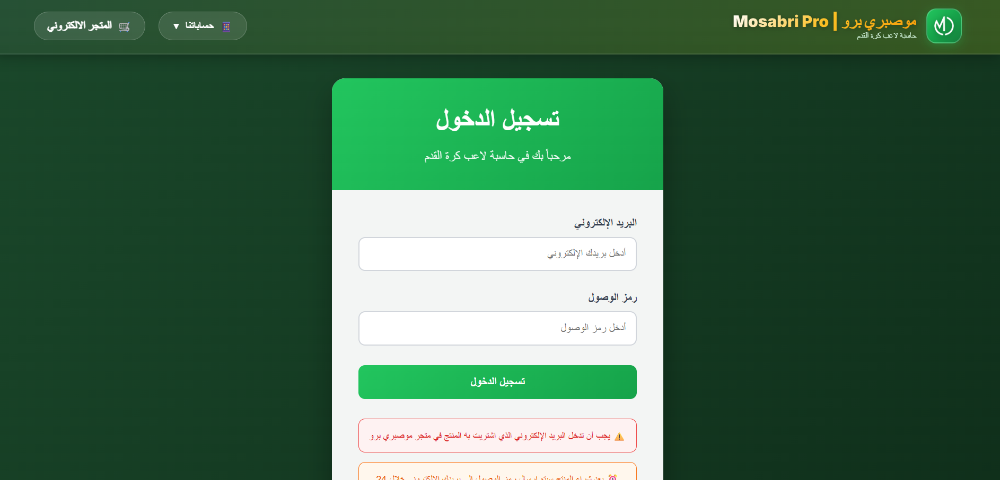</td>
    <td align="center"><strong>Calculator Page</strong> 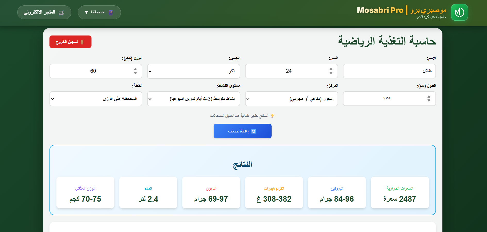</td>
    <td align="center"><strong>Dashboard Page</strong> 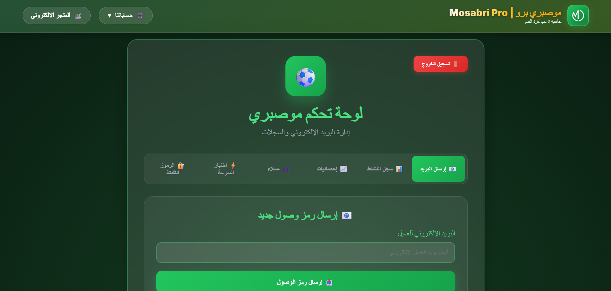</td>
  </tr>
  <tr>
    <td align="center"><strong>PDF Report</strong> </td>
    <td align="center"><strong>Admin Login</strong> 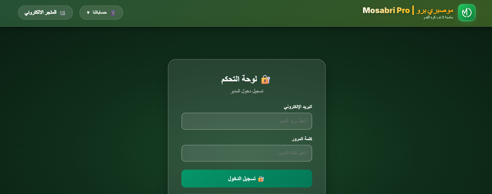</td>
    <td align="center"><strong>Calculator Page 2</strong> 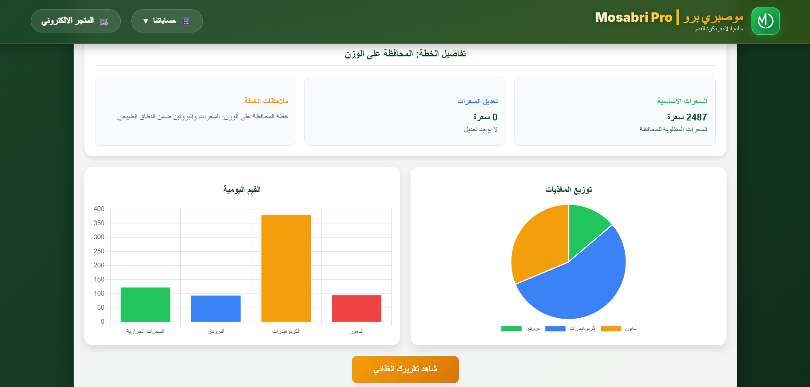</td>
  </tr>
</table>

---

## Full Interface Gallery

Click to view all uploaded screens

 

<table>
  <tr>
    <td align="center"><strong>Login Page</strong> </td>
    <td align="center"><strong>Admin Login</strong> </td>
    <td align="center"><strong>Calculator Page 1</strong> </td>
    <td align="center"><strong>Calculator Page 2</strong> </td>
  </tr>

  <tr>
    <td align="center"><strong>Dashboard Page 1</strong> </td>
    <td align="center"><strong>Dashboard Page 2</strong> 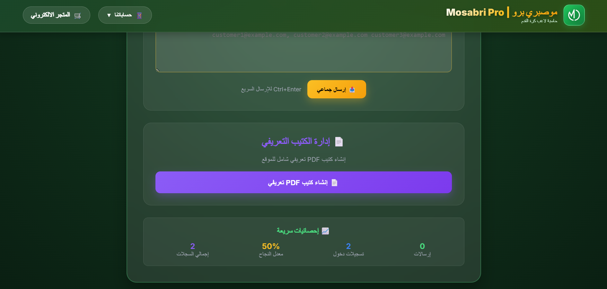</td>
    <td align="center"><strong>Dashboard Page 3</strong> 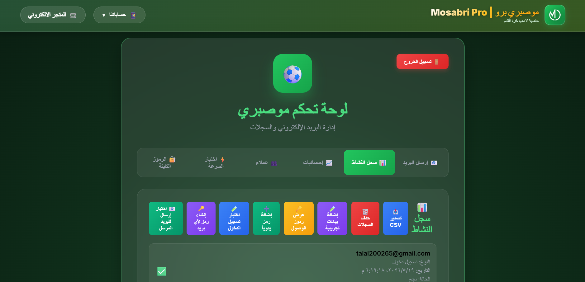</td>
    <td align="center"><strong>Dashboard Page 4</strong> 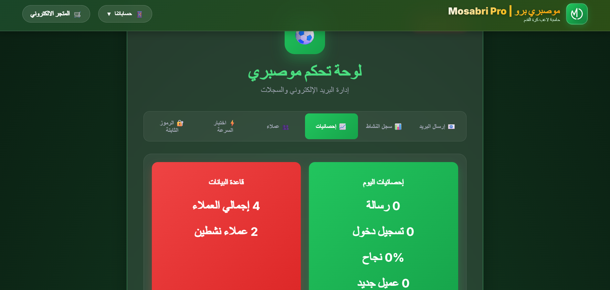</td>
  </tr>

  <tr>
    <td align="center"><strong>Dashboard Page 5</strong> 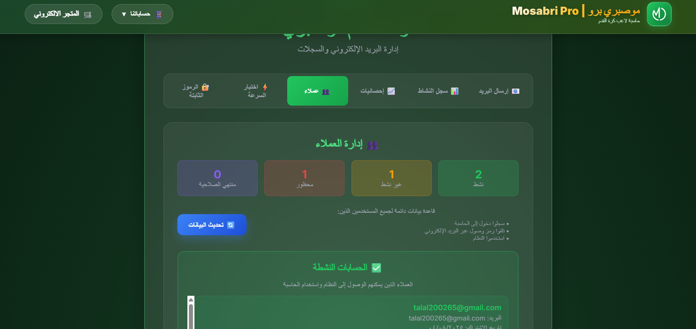</td>
    <td align="center"><strong>Dashboard Page 6</strong> 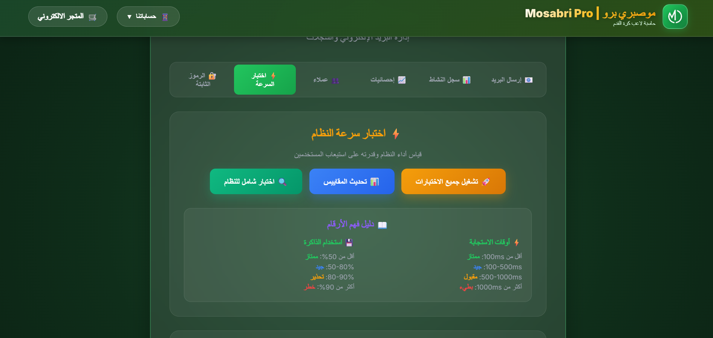</td>
    <td align="center"><strong>PDF Generator 1</strong> </td>
    <td align="center"><strong>PDF Generator 2</strong> 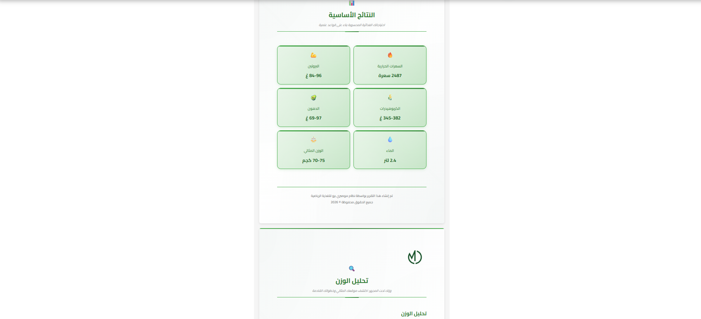</td>
  </tr>
</table>

---

## User Flow

The project experience can be summarized as follows:

1. The user enters the platform through the login/access process.  
2. Access is controlled through an **email-based key generation flow**.  
3. The user completes the calculator input steps.  
4. The platform processes the entered data and displays structured results.  
5. The results are presented through dashboard pages.  
6. A final **PDF report** can be generated and downloaded.

---

## Technologies & Tools

| Category | Tools / Technologies |
|---|---|
| Frontend | Next.js, React, TypeScript |
| Styling | Tailwind CSS |
| Backend Logic | Route Handlers / Server-side logic |
| Database | PostgreSQL |
| Authentication | JWT, access-code flow |
| Email / Access Delivery | Nodemailer |
| Output Generation | PDF generation |
| Product Type | Digital web product |

---

## Project Value

This project demonstrates practical skills in:

- Building structured web-based user flows
- Translating a health-related idea into a digital product
- Designing dashboard-based web interfaces
- Automating report generation
- Connecting access control with user input flow
- Presenting a simple product in a clear and professional way

---

## Repository Note

This repository is prepared as a **project showcase**.

It focuses on presenting the product concept, UI screens, and project structure.  
The full source code is not publicly shared due to sensitive project files and private configuration details.

---

**Developed as a Personal Project**  
Digital Product Showcase

